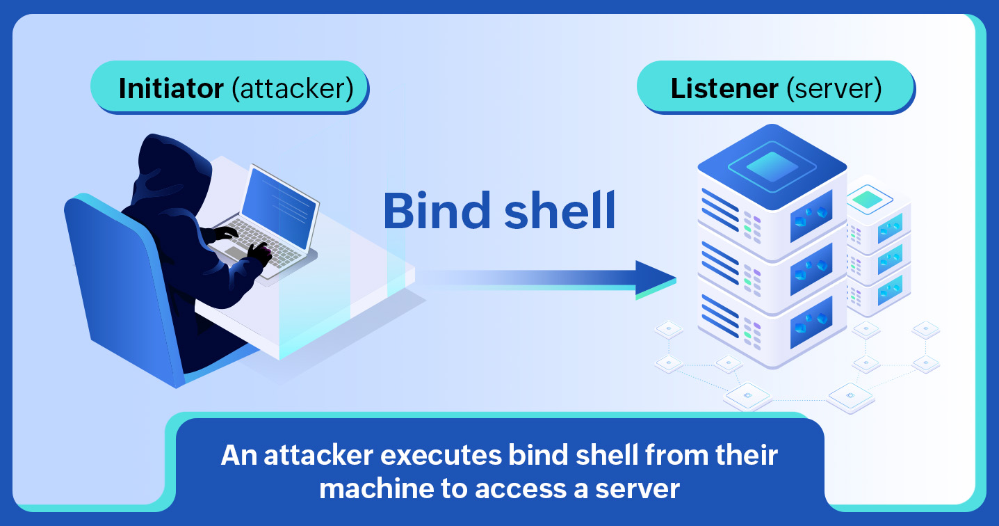

# REVERSE SHELL ASM 


## Description
This project implements a lightweight reverse shell written entirely in x86_64 assembly.
The shell establishes a TCP connection to the specified server, and redirects standard input/output/error to the socket. Upon successful connection, it spawns an interactive /bin/bash shell, enabling remote command execution. The code handles connection retries with a delay and includes basic error handling.
This low-level implementation demonstrates socket programming, syscall usage, and network byte order conversions in assembly language.

## How to run
```bash
└─$ nasm -f elf64 main.asm                             
└─$ ld main.o -o reverse                                   
└─$ ./reverse
```
The default IP adress is 127.0.0.1 and the default port is 1337.

## Contributing

- Simon CORVISIER 3SI-4
- Kades KOUKPONOU 3SI-4

